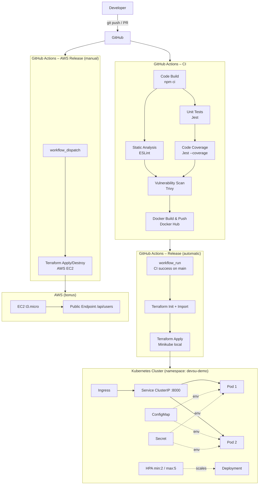

# Demo DevOps NodeJs

REST API for the Devsu DevOps technical test, built with **Node.js 18**, **Express**, and **SQLite**.

## Quick Links

- Repository: https://github.com/jml0405/devsu-demo-devops-nodejs
- GitHub Actions (all runs): https://github.com/jml0405/devsu-demo-devops-nodejs/actions
- CI workflow: https://github.com/jml0405/devsu-demo-devops-nodejs/actions/workflows/ci.yml
- Minikube release workflow: https://github.com/jml0405/devsu-demo-devops-nodejs/actions/workflows/release.yml
- AWS release workflow (manual): https://github.com/jml0405/devsu-demo-devops-nodejs/actions/workflows/release-aws.yml
- Public endpoint (AWS bonus path): http://3.149.0.56/api/users

> Endpoint validated on **February 23, 2026**. It can change after a new deploy/destroy in AWS.

---

## Architecture



---

## Scope Delivered

- Dockerized Node.js API (non-root user, healthcheck-ready behavior, configurable env vars).
- CI pipeline with build, lint, tests, coverage, Trivy FS scan, Docker build/push, Trivy image scan.
- Automatic release to **local Minikube** after successful CI on `main`.
- Kubernetes resources as code with Terraform: Namespace, ConfigMap, Secret, Deployment, Service, Ingress, HPA.
- Optional bonus IaC on AWS (EC2 + VPC + SG + subnet + route table + IGW) via manual workflow.

---

## Local Development

### Prerequisites

- Node.js `18.x`
- Docker `24+`
- `kubectl`
- `minikube`
- Terraform `>=1.6` (for local IaC apply)

### Install

```bash
git clone https://github.com/jml0405/devsu-demo-devops-nodejs.git
cd devsu-demo-devops-nodejs
npm ci
```

### Run API locally

```bash
npm run start
# http://localhost:8000/api/users
```

### Run quality checks

```bash
npm run lint
npm test
npm run test:coverage
```

---

## Docker

### Build

```bash
docker build -t devsu-demo-nodejs .
```

### Run

```bash
docker run -p 8000:8000 \
  -e DATABASE_NAME="./dev.sqlite" \
  -e DATABASE_USER="user" \
  -e DATABASE_PASSWORD="password" \
  devsu-demo-nodejs
```

### Quick test

```bash
curl http://localhost:8000/api/users
curl -X POST http://localhost:8000/api/users \
  -H "Content-Type: application/json" \
  -d '{"dni":"12345678","name":"Jane Doe"}'
```

---

## CI/CD

### CI (`.github/workflows/ci.yml`)

Runs on push and pull request to `main`.

| Stage | Tool | Result |
|---|---|---|
| Build | `npm ci` | Dependency install validation |
| Static analysis | ESLint | Code quality gate |
| Unit tests | Jest | Functional validation |
| Coverage | Jest `--coverage` | Coverage artifact upload |
| Vulnerability scan (repo) | Trivy FS | `trivy-fs-report` artifact |
| Docker build & push | Docker Buildx + Docker Hub | Versioned image + `latest` |
| Vulnerability scan (image) | Trivy image | `trivy-image-report-<tag>` artifact |
| Metadata export | JSON/txt artifact | `image-metadata-<tag>` |

### Image Versioning Strategy

Image tag format is deterministic and visible in Actions:

`v<package.json version>-<github run number>-<short git sha>`

Example: `v1.0.0-28-a1b2c3d`

Implementation:

- Script: `scripts/compute_image_tag.py`
- CI Summary publishes final `image:tag`
- Metadata artifact includes tag, image ref, SHA, run number, and branch

### Automatic Release to Minikube (`.github/workflows/release.yml`)

Trigger: `workflow_run` when CI succeeds from a `push` to `main`.

Main steps:

1. Checkout exact commit from CI run.
2. Recompute same image tag used in CI.
3. `terraform init` in `terraform/`.
4. Idempotent `terraform import` of already-existing resources.
5. `terraform apply -auto-approve`.
6. Rollout verification and pod listing.
7. Release Summary with image and source CI run.

### Optional AWS Release (`.github/workflows/release-aws.yml`)

Trigger: manual (`workflow_dispatch`) only.

Actions:

- `action=deploy` deploys/updates AWS infrastructure.
- `action=destroy` destroys AWS resources to stop cost.

AWS workflow also publishes:

- `public_endpoint`
- `public_ip`
- `image_deployed`
- `aws-terraform-output-<tag>` artifact

---

## GitHub Secrets

| Secret | Used by | Purpose |
|---|---|---|
| `DOCKERHUB_USERNAME` | `ci.yml`, `release.yml`, `release-aws.yml` | Docker image name/login |
| `DOCKERHUB_TOKEN` | `ci.yml` | Docker Hub authentication |
| `DB_USER` | `release.yml` | Terraform `TF_VAR_database_user` |
| `DB_PASSWORD` | `release.yml` | Terraform `TF_VAR_database_password` |
| `AWS_ACCESS_KEY_ID` | `release-aws.yml` | AWS auth for Terraform |
| `AWS_SECRET_ACCESS_KEY` | `release-aws.yml` | AWS auth for Terraform |
| `AWS_TF_STATE_BUCKET` | `release-aws.yml` | Terraform S3 remote backend |

---

## Runner Requirements (Minikube Release)

The self-hosted runner used by `release.yml` must have:

- `minikube` running
- `kubectl` configured for `minikube` context
- Terraform installed
- Access to Docker Hub images
- Kubernetes ingress addon enabled (if testing ingress locally)

Useful checks:

```bash
minikube status
kubectl config current-context
terraform version
minikube kubectl -- get nodes
```

---

## Terraform IaC

### Local Kubernetes IaC (`terraform/`)

Resources managed:

- `kubernetes_namespace`
- `kubernetes_config_map`
- `kubernetes_secret`
- `kubernetes_deployment`
- `kubernetes_service`
- `kubernetes_ingress_v1`
- `kubernetes_horizontal_pod_autoscaler_v2`

Manual local apply:

```bash
minikube start
minikube addons enable ingress
kubectl config use-context minikube

cd terraform
terraform init
terraform apply -auto-approve \
  -var="image_name=<dockerhub_user>/devsu-demo-nodejs" \
  -var="image_tag=latest" \
  -var="database_user=user" \
  -var="database_password=password" \
  -var="kubeconfig_context=minikube"
```

Verify:

```bash
minikube kubectl -- get pods -n devsu-demo
minikube kubectl -- get svc -n devsu-demo
minikube kubectl -- get ingress -n devsu-demo
minikube kubectl -- get hpa -n devsu-demo
```

### AWS Bonus IaC (`terraform-aws/`)

Creates:

- VPC
- Public subnet
- Internet gateway
- Public route table + association
- Security group
- EC2 instance running the selected Docker image

Public endpoint currently reported:

- http://3.149.0.56/api/users

Destroy to avoid charges:

- Run `release-aws.yml` with `action=destroy`

---

## Evidence for Submission

- Actions index: https://github.com/jml0405/devsu-demo-devops-nodejs/actions
- CI workflow page: https://github.com/jml0405/devsu-demo-devops-nodejs/actions/workflows/ci.yml
- Minikube release workflow page: https://github.com/jml0405/devsu-demo-devops-nodejs/actions/workflows/release.yml
- AWS release workflow page: https://github.com/jml0405/devsu-demo-devops-nodejs/actions/workflows/release-aws.yml
- Public endpoint: http://3.149.0.56/api/users

---

## Requirement Checklist

| Requirement | Status | Evidence |
|---|---|---|
| Public GitHub repository with versioned code | Complete | Git history + workflows |
| Dockerized app | Complete | `Dockerfile` |
| Build, tests, lint, coverage pipeline | Complete | `.github/workflows/ci.yml` |
| Vulnerability scans (optional) | Complete | Trivy jobs + artifacts |
| Kubernetes deploy from pipeline | Complete | `.github/workflows/release.yml` |
| Kubernetes resources (ConfigMap, Secret, Ingress, HPA, etc.) | Complete | `terraform/*.tf` |
| Minimum 2 replicas + autoscaling | Complete | `terraform/deployment.tf`, `terraform/hpa.tf` |
| README with architecture and deployment docs | Complete | This file |
| Bonus IaC in public cloud provider | Complete | `terraform-aws/` + `release-aws.yml` |
| Public endpoint URL | Complete | http://3.149.0.56/api/users |
| Deliverable `.zip`/`.rar` | Complete | `devsu-demo-devops-nodejs-entrega.zip` |

---

## API Reference

### `GET /api/users`

Returns all users.

```json
[{ "id": 1, "dni": "12345678", "name": "Jane Doe" }]
```

### `GET /api/users/:id`

Returns one user by ID (`404` if not found).

### `POST /api/users`

Creates a new user.

Request body:

```json
{ "dni": "12345678", "name": "Jane Doe" }
```

Response (`201`):

```json
{ "id": 1, "dni": "12345678", "name": "Jane Doe" }
```

---

## License

Copyright © 2023 Devsu. All rights reserved.
